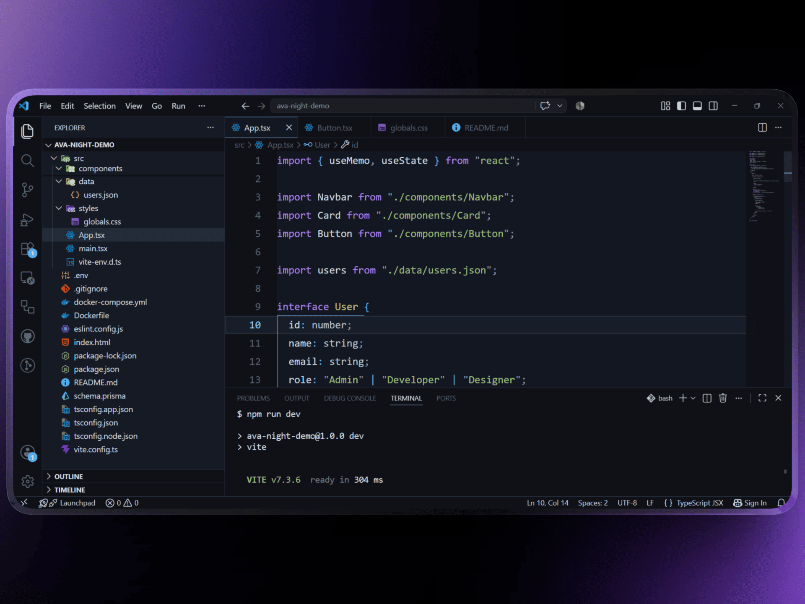
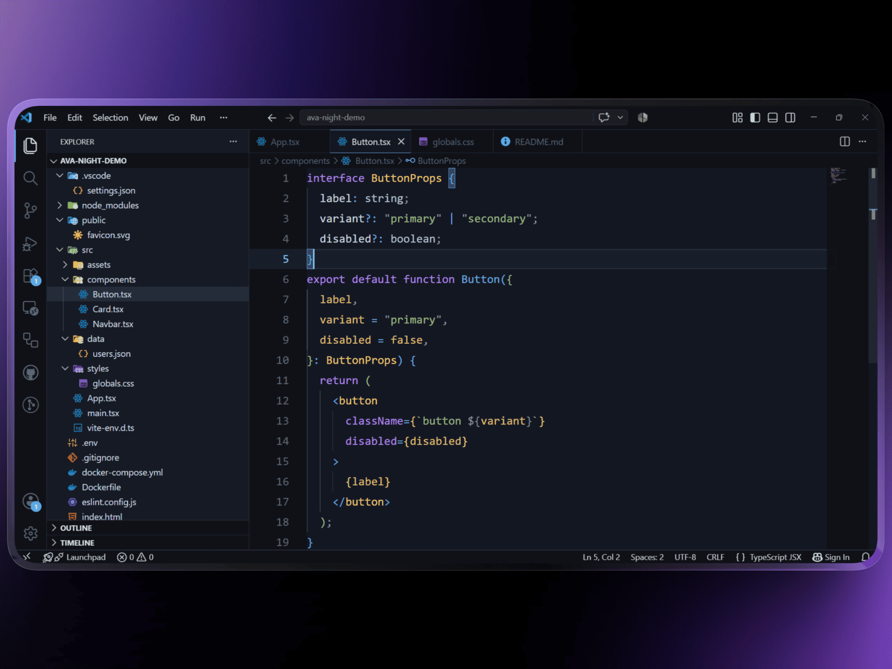
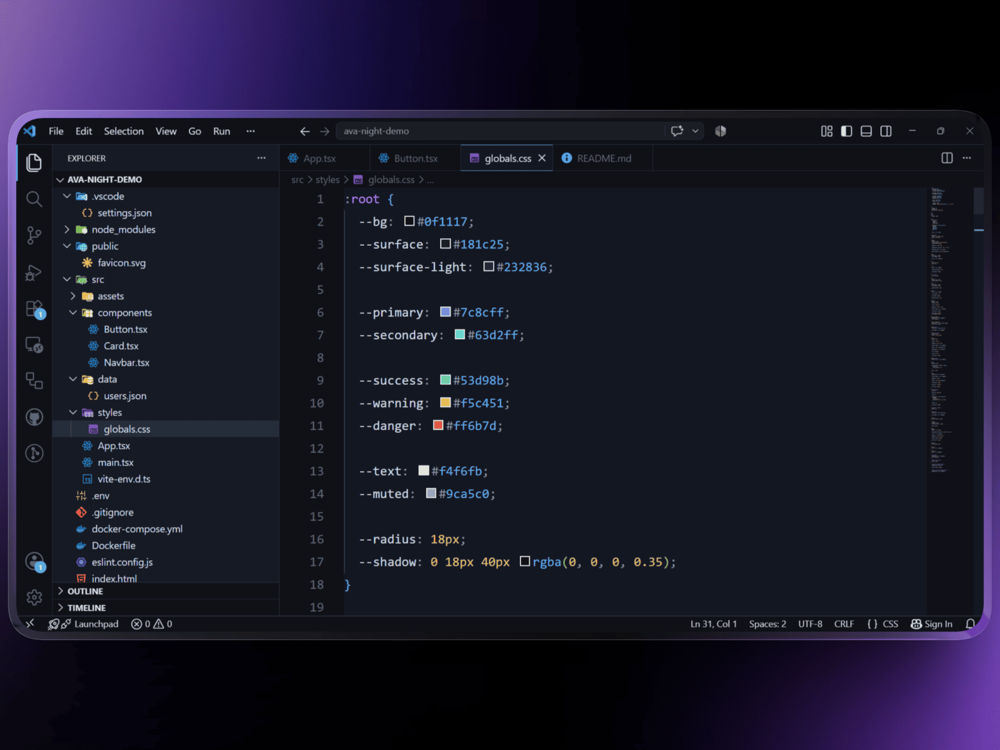
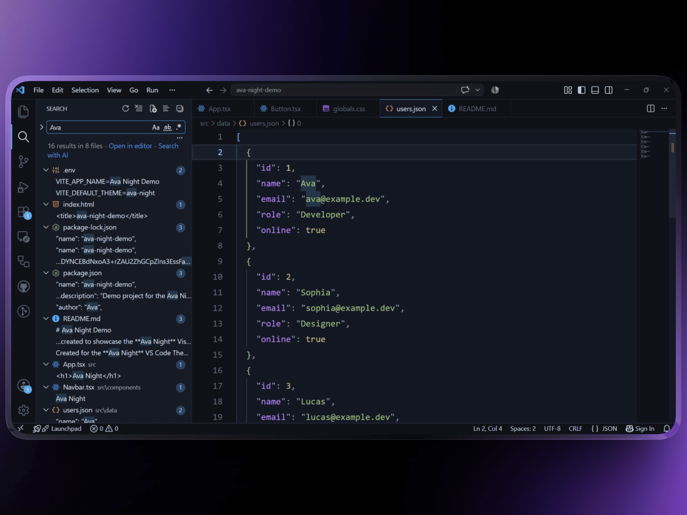

<div align="center">

    # 🌙 Ava Night

    ## Where code meets the quiet of midnight

    A calm, midnight Visual Studio Code theme built around **focus, readable contrast, and meaningful color**.

    

    [](https://github.com/Ava-91/ava-night/releases)
    [](https://github.com/Ava-91/ava-night/blob/main/LICENSE)
    [](https://code.visualstudio.com/)
    [](tools/theme-diagnostics.js)

    Calm • Focused • Readable • Midnight

</div>

---

## ✨ Why Ava Night?

Ava Night is for developers who prefer **calm over clutter**. Its visual identity is simple: **a monochrome moonlit mark outside, a midnight-blue workspace inside.**

- 🌌 Deep, layered midnight surfaces
- 🔵 Electric blue for primary interaction and focus
- 🩵 Icy cyan for high-attention details
- 🟣 Violet for structural syntax
- 🟢 Green for strings and success states
- 🟡 Gold for types, numbers, warnings, and modified states
- 🔴 Red for errors and destructive states
- 🧠 Semantic highlighting with consistent color roles
- ⚡ Zero runtime dependencies

## 📸 See the theme in action

### React + TypeScript



### CSS



### JSON



---

## 🎨 Color Philosophy

> **Every color should communicate meaning—not compete for attention.**

| Role | Hex |
| --- | --- |
| Deep background | `#0F1117` |
| Editor background | `#131722` |
| Panel background | `#151A24` |
| Borders | `#242C3A` |
| Primary text | `#D8DEE9` |
| Focus / primary accent | `#61AFEF` |
| Special / high-attention accent | `#7FDBFF` |
| Secondary structure | `#B48EFA` |
| Success / added | `#98C379` |
| Warning / modified | `#FFD166` |
| Error / deleted | `#F07178` |
| Numeric constants | `#E5C07B` |

The palette deliberately separates **identity** from **semantics**: blue and cyan establish the interface, while the remaining accents communicate syntax and state.

---

## 🧪 Quality & diagnostics

Ava Night is backed by machine-readable theme QA rather than relying only on visual inspection.

```bash
npm test
npm run diagnostics
npm run quality
npm run qa
npm run vscode:smoke
npm run vsix:smoke
npm run release:check
```

`npm run qa` is the single audit entry point. It runs diagnostics and quality checks, verifies important contrast/state coverage and the 15-language fixture matrix, then writes `tests/results/qa-report.json` and `tests/results/qa-report.md`.

The repository validates theme metadata, color definitions, semantic roles, contrast pairs, syntax fixtures, and VSIX packaging in CI. The VS Code smoke test also verifies that a packaged extension can be installed and launched with the Ava Night theme selected.

The local VS Code inspector under `tools/theme-inspector/` can record semantic-token information from the fixture matrix into `tests/results/` for regression review.

> **No screenshot is required for the programmatically testable parts of the theme.** Exact workbench rendering and layout remain visual concerns; the automated reports make the machine-checkable portion directly inspectable from the repository.

---

## 🚀 Install

### Visual Studio Marketplace

1. Open **Extensions** (`Ctrl + Shift + X`).
2. Search for **Ava Night**.
3. Click **Install**.
4. Select **Ava Night** from **Preferences → Color Theme**.

### VSIX

1. Download the latest release.
2. Open **Extensions**.
3. Select **⋯ → Install from VSIX...**.
4. Choose the `.vsix` file.

---

## 🛠 Development

```bash
git clone https://github.com/Ava-91/ava-night.git
cd ava-night
npm install
```

Press **F5** in Visual Studio Code to launch an Extension Development Host.

### Useful commands

| Command | Purpose |
| --- | --- |
| `npm test` | Run automated tests |
| `npm run diagnostics` | Generate theme diagnostics |
| `npm run quality` | Run comprehensive theme quality checks |
| `npm run qa` | Run the complete accessibility/visual QA audit |
| `npm run vscode:smoke` | Install the VSIX and launch a representative fixture in VS Code |
| `npm run vsix:smoke` | Validate the packaged VSIX contents |
| `npm run release:check` | Validate release metadata and packaging prerequisites |

---

## 📚 Language Support

The fixture matrix is maintained under `tests/syntax`. A checkmark means the repository has a dedicated fixture for that language. Semantic coverage refers to the theme's explicit semantic-token roles; it does not guarantee that every language server emits every role.

| Language        | Syntax   | Semantic  | Fixture |
| --------------- | :------: | :-------: | :-----: |
| TypeScript      | ✅        | ✅        | ✅      |
| TSX / React     | ✅        | ✅        | ✅      |
| JavaScript      | ✅        | ✅        | ✅      |
| Python          | ✅        | ✅        | ✅      |
| Rust            | ✅        | ✅        | ✅      |
| Go              | ✅        | ✅        | ✅      |
| C++             | ✅        | ✅        | ✅      |
| CSS             | ✅        | —         | ✅      |
| HTML            | ✅        | —         | ✅      |
| JSON            | ✅        | —         | ✅      |
| JSONC            | ✅        | —         | ✅      |
| Markdown        | ✅        | —         | ✅      |
| Shell            | ✅        | —         | ✅      |
| SQL              | ✅        | —         | ✅      |
| YAML             | ✅        | —         | ✅      |

Semantic roles currently covered include: functions, methods, macros, builtins, keywords, namespaces, modules, types, classes, interfaces, enums, enum members, type parameters, strings, regexps, decorators, annotations, labels, events, numbers, variables, readonly variables, properties, readonly properties, parameters, operators, modifiers, and comments.

---

## 📈 Roadmap

- Additional language-specific optimizations
- Expanded semantic highlighting
- More polished terminal colors
- Future Ava Night variants

---

## 🤝 Feedback

Found a bug or have an idea? [Open an issue](https://github.com/Ava-91/ava-night/issues).

If Ava Night improves your coding experience, consider leaving a ⭐ on the repository.

---

## 📄 License

Released under the **MIT License**.
